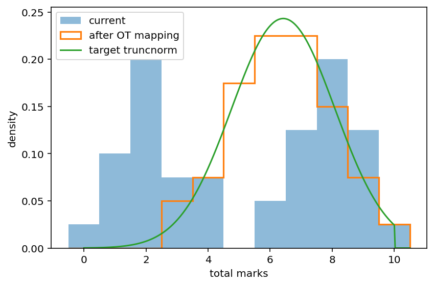

# OAT: optimal assessment tool

A lightweight Python tool that applies optimal transport (OT) to classroom mark data. It helps diagnose bimodal results, set a realistic pass rate, and identify assessment items that need adjustment.

## why

* **reshape distributions** – OT tells you the smallest per‑student mark changes needed to reach a chosen target curve (by default: an 80 %‑pass truncated normal).
* **spot weak questions** – item analytics flag tasks that are too easy, too hard, or non‑discriminative.
* **actionable advice** – the script recommends where to add partial credit, split hard items, or tone down giveaways.

## what it does

1. **read marks** – a CSV with `student_id` and item columns (`q1`, `q2`, …).
2. **plot before/after** – current histogram, OT‑mapped histogram (outline), and target curve.
3. **quantile shifts** – prints the marks adjustment required in each percentile band.
4. **item report** – classifies every question by difficulty and Pearson item–total correlation.
5. **recommendations** – plain‑English suggestions for next year’s assessment.

## usage

```bash
cd src/oat/
python oat.py marks.csv
```

## sample output



```
average shift to target truncnorm: +1.18

  band 1/5: +3.03 marks
  band 2/5: +2.81 marks
  band 3/5: +0.59 marks
  band 4/5: -0.50 marks
  band 5/5: -0.41 marks

bimodality – fail 48%, mid 18%, high 35%

item summary (facility=mean/max)
--------------------------------
item  facility  discrimination
  q1      0.53            0.78
  q2      0.50            0.78
  q3      0.60            0.81
  q4      0.50            0.70
  q5      0.60            0.66
  q6      0.50            0.78
  q7      0.47            0.63
  q8      0.57            0.71
  q9      0.05            0.21
 q10      0.85            0.30

recommendations
---------------

 • Distribution strongly bimodal – add medium‑difficulty items or partial credit to build the middle band.
 • q9 too hard – split or add partial credit.

%runfile /Users/30045063/Code/2025/ot-assessment-tool/src/oat/oat.py --wdir
average shift to target truncnorm: +1.18

  band 1/5: +3.03 marks
  band 2/5: +2.81 marks
  band 3/5: +0.59 marks
  band 4/5: -0.50 marks
  band 5/5: -0.41 marks

bimodality – fail 48%, mid 18%, high 35%

item summary (facility=mean/max)
--------------------------------
item  facility  discrimination
  q1      0.53            0.78
  q2      0.50            0.78
  q3      0.60            0.81
  q4      0.50            0.70
  q5      0.60            0.66
  q6      0.50            0.78
  q7      0.47            0.63
  q8      0.57            0.71
  q9      0.05            0.21
 q10      0.85            0.30

recommendations
---------------

 • Distribution strongly bimodal – add medium‑difficulty items or partial credit to build the middle band.
 • q9 too hard – split or add partial credit.
```

### input format

```
student_id,q1,q2,q3,q4,...
s001,1,1,0,1
s002,0,1,1,0
...
```

*Optional* first line labelled `max` lets you specify the maximum mark per item for multi‑mark tasks.

### configuration flags (top of the script)

* `PASS_RATE_TARGET` – fraction of students that should pass (default 0.8).
* `TARGET_DIST` – `"truncnorm"` (bounded normal, default) or `"beta"`.
* difficulty thresholds (`FACILITY_EASY`, `FACILITY_HARD`) and discrimination cut‑off (`DISCRIM_POOR`).

## requirements

```
pandas
numpy
matplotlib
scipy
```

Install with `pip install -r requirements.txt`.

## limitations

* Needs **item‑level** marks (many small items work best).
* Recommendations assume binary correctness: partial‑credit items are treated as proportional scores.
* Results are descriptive, not prescriptive: teaching context still matters.

## licence

MIT (see `LICENSE`).
